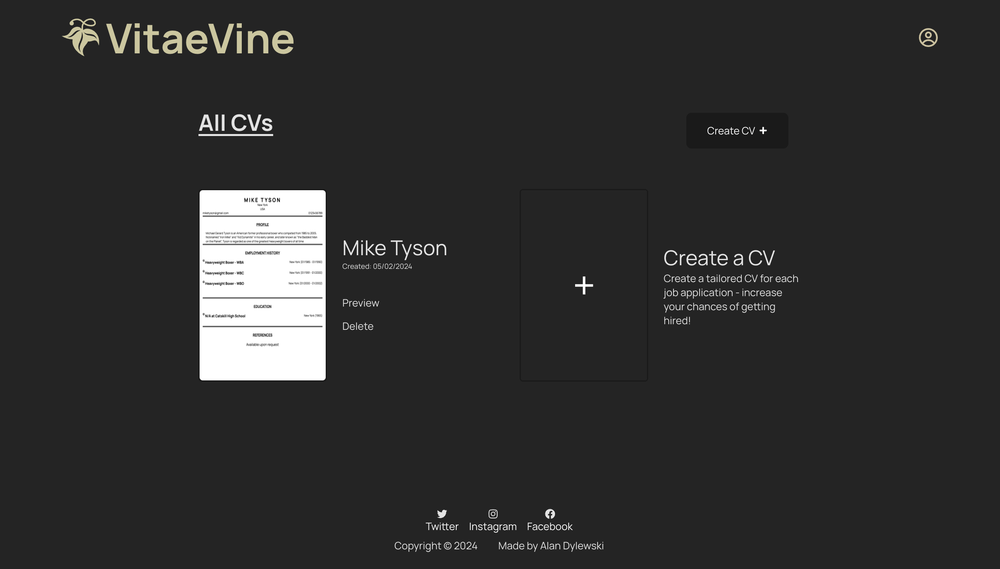
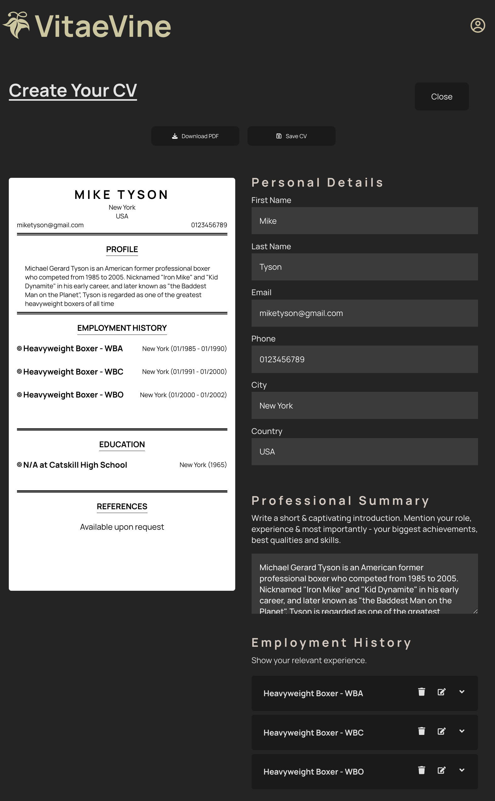
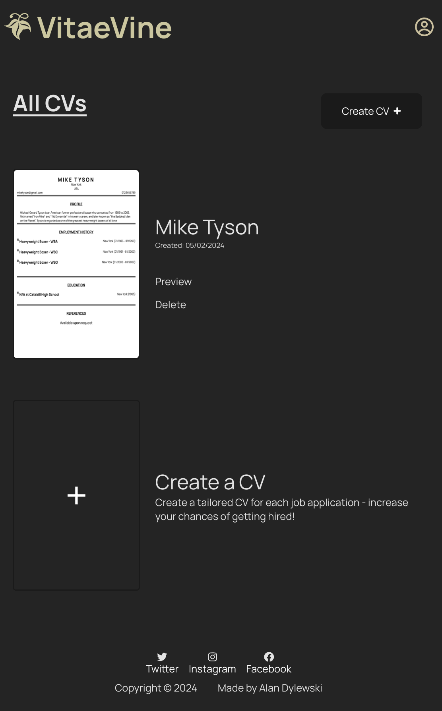
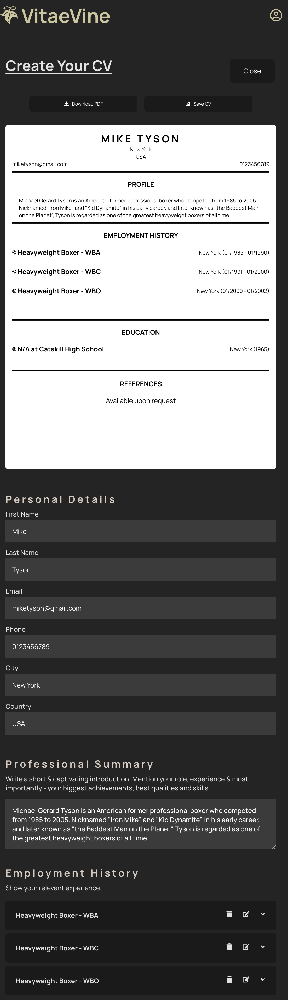

# cv-builder

Vitae Vine: From Roots to Results – Your CV Companion.

Live 👉 https://vitae-vine.netlify.app/

## Desktop Version:

## Mobile Version:

## Project Objectives:

1. Utilise state and props to create a CV building web app.
2. Include sections that allow users to add:

- general information like name, email and phone number.
- educational experience (school name, title of study and date of study)
- practical experience (company name, position title, main responsibilities of a job, dates worked at given company).

3. Allow users to download CV as a PDF.

## Future Improvements:

1. Adding the ability to Edit once a CV has been generated.
2. Adding the ability to Download once a CV has been generated.
3. Adding a Profile section.

## Credits:

Font Awesome Icons (https://fontawesome.com/)
License - CC BY 4.0 DEED (https://creativecommons.org/licenses/by/4.0/)
